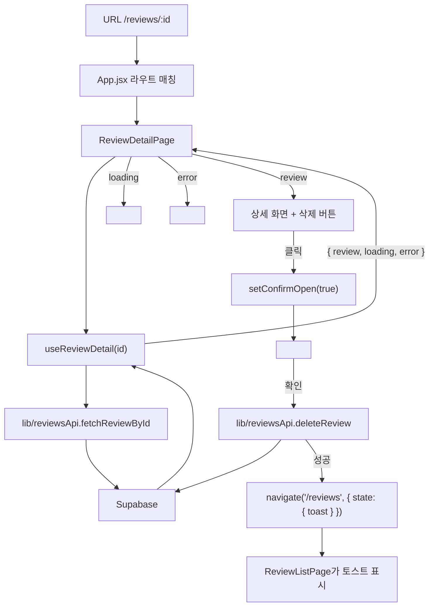

# 무비로그

본 영화와 드라마의 감상을 별점과 함께 기록하는 React SPA.

| | |
| --- | --- |
| **배포 URL** | https://b1-2.vercel.app |
| **저장소** | https://github.com/NamJungHyeon/B1-2 |
| **백엔드** | Supabase (PostgreSQL + Auth + Storage) |

배포 환경에서 목록 조회 · 상세 조회 · 등록 · 수정 · 삭제 · 로그인 · 포스터 업로드가 모두 동작하는 것을 확인했다.
`/reviews/:id`처럼 깊은 경로로 직접 접속해도 404가 나지 않는다.

## 목차

### 동료 평가 보완 항목 바로가기

| 평가 항목 | README에서 확인할 근거 |
| --- | --- |
| #5 배포 URL·환경변수 | 상단 배포 URL, [환경변수](#환경변수), [배포](#배포) |
| #7 폴더 분리 이유·파일 배치 기준 | [폴더 구조와 책임](#폴더-구조와-책임) |
| #10 props와 state·상향/하향 흐름 | [평가 답변: props와 state의 위치](#평가-답변-props와-state의-위치) |
| #15 Supabase 선택 이유·인증·연동 경험 | [왜 Supabase인가](#왜-supabase인가), [인증과 RLS](#인증과-rls), [개발하며 겪은 문제](#개발하며-겪은-문제) |

위 번호는 전달받은 평가 결과 기준이다. 아래 설명은 이 저장소의 실제 구현을 기준으로 한다.

1. [기술 스택](#기술-스택)
2. [왜 Supabase인가](#왜-supabase인가)
3. [빠른 시작](#빠른-시작)
4. [아키텍처](#아키텍처)
5. [라우트와 네비게이션](#라우트와-네비게이션)
6. [재사용 컴포넌트](#재사용-컴포넌트)
7. [커스텀 훅](#커스텀-훅)
8. [상태 관리 원칙](#상태-관리-원칙)
9. [useEffect 사용 지점](#useeffect-사용-지점)
10. [폼 UX와 에러 처리](#폼-ux와-에러-처리)
11. [인증과 RLS](#인증과-rls)
12. [테스트](#테스트)
13. [배포](#배포)
14. [개발하며 겪은 문제](#개발하며-겪은-문제)

---

## 기술 스택

| 영역 | 선택 | 이유 |
| --- | --- | --- |
| 빌드 | Vite + React 19 | 설정 없이 바로 시작. React 18 이상 요건 충족 |
| 언어 | JavaScript | 과제 평가가 React 흐름 이해에 있어 타입 정의에 시간을 쓰지 않음 |
| 라우팅 | React Router v7 | 중첩 라우트로 공통 레이아웃과 보호 라우트를 선언적으로 구성 |
| 스타일 | Tailwind CSS v4 | 컴포넌트마다 CSS 파일을 만들지 않아도 됨 |
| 백엔드 | Supabase | 아래 참고 |
| 배포 | Vercel | GitHub 연동으로 push마다 자동 배포 |
| 테스트 | Vitest + React Testing Library | Vite와 설정을 공유, 사용자 관점 테스트 |

## 왜 Supabase인가

과제는 Supabase 또는 Firebase 중 하나를 요구했다. Supabase를 고른 이유:

1. **관계형 스키마가 명시적이다.** `reviews` 테이블의 컬럼과 제약(`rating between 1 and 5`, `media_type in ('영화','드라마')`)을 SQL로 정의해 해당 조건에 어긋나는 데이터를 DB에서 거부할 수 있다. 리뷰 필드와 작성자 관계를 명확히 표현하기에 적합했다.
2. **요청·응답 흐름을 React에서 직접 다룰 수 있다.** `supabase.from('reviews').select()`를 `await`하고 결과를 state에 저장하면서 로딩·성공·실패를 구현했다. 별도 백엔드 서버를 구축하지 않고 React 학습에 집중할 수 있었다.
3. **RLS(Row Level Security)로 권한을 DB에서 강제한다.** "본인 글만 수정·삭제"를 화면에서 버튼을 숨기는 것으로 끝내지 않고, 서버가 `auth.uid() = user_id`를 검사한다. 화면 우회 시도가 실제로 막히는지 검증할 수 있었다.
4. **Auth와 Storage가 같은 프로젝트에 있다.** 로그인과 포스터 업로드를 추가할 때 별도 서비스를 붙이지 않았다.

연동하면서 겪은 주의점은 [개발하며 겪은 문제](#개발하며-겪은-문제)에 정리했다.

**인증은 구현되어 있다.** Supabase Auth의 이메일·비밀번호 회원가입, 로그인, 로그아웃을 사용한다. `AuthContext`가 세션을 공유하고 `ProtectedRoute`가 등록·수정·내 기록 경로를 보호한다. 읽기는 공개하며, 쓰기 권한은 리뷰의 `user_id`와 로그인 사용자 ID를 비교하는 RLS 정책으로 제한한다.

## 빠른 시작

### 로컬 실행

```bash
git clone https://github.com/NamJungHyeon/B1-2.git
cd B1-2
npm install
cp .env.example .env   # 아래 환경변수 두 개를 채운다
npm run dev
```

### 환경변수

| 이름 | 값 |
| --- | --- |
| `VITE_SUPABASE_URL` | Supabase 프로젝트 URL. `https://<ref>.supabase.co` 형태 |
| `VITE_SUPABASE_ANON_KEY` | Supabase의 `anon public` 키 (새 대시보드에서는 `publishable`) |

Supabase 대시보드 → Project Settings → API에서 확인한다.
값이 없으면 앱은 흰 화면 대신 "Supabase 환경변수가 없습니다" 안내를 띄운다.

주의:

- **URL은 브라우저 주소창의 대시보드 주소가 아니다.** `https://supabase.com/dashboard/project/<ref>`를 넣으면 CORS에 막힌다.
- `service_role` 키는 RLS를 무시하는 관리자 키다. 프론트엔드 코드에 절대 넣지 않는다.

### Supabase 설정

SQL Editor에서 순서대로 실행한다.

**1. 테이블과 RLS**

```sql
create table reviews (
  id uuid primary key default gen_random_uuid(),
  title text not null,
  media_type text not null check (media_type in ('영화', '드라마')),
  rating smallint not null check (rating between 1 and 5),
  content text not null,
  poster_url text,
  watched_date date,
  created_at timestamptz not null default now(),
  user_id uuid references auth.users(id) on delete cascade
);

alter table reviews enable row level security;

create policy "read all"   on reviews for select using (true);
create policy "insert own" on reviews for insert with check (auth.uid() = user_id);
create policy "update own" on reviews for update using (auth.uid() = user_id) with check (auth.uid() = user_id);
create policy "delete own" on reviews for delete using (auth.uid() = user_id);
```

**2. Storage (포스터 파일 첨부)**

Storage에서 `posters` 버킷을 **Public**으로 만든 뒤:

```sql
create policy "posters read"   on storage.objects for select using (bucket_id = 'posters');
create policy "posters upload" on storage.objects for insert to authenticated with check (bucket_id = 'posters');
```

**3. Auth**

Authentication → Sign In / Providers → Email에서 **Confirm email**을 끈다. (과제용. 켜두면 가입 후 메일 인증 전까지 로그인이 안 된다.)

**4. 샘플 데이터 (선택)**

[`docs/seed-reviews.sql`](docs/seed-reviews.sql)을 실행하면 리뷰 20개가 들어간다.

### 명령어

| 명령 | 설명 |
| --- | --- |
| `npm run dev` | 개발 서버 (http://localhost:5173) |
| `npm run build` | 프로덕션 빌드 |
| `npm test` | 테스트 실행 |
| `npm run test:watch` | 테스트 watch 모드 |

## 아키텍처

### 폴더 구조와 책임

```
src/
├── main.jsx           BrowserRouter로 App을 감싸 마운트
├── App.jsx            라우트 정의. AuthProvider로 전체를 감쌈
├── pages/             라우트 단위 화면
├── components/        재사용 UI 컴포넌트
├── hooks/             데이터 조회·페이지네이션 로직
├── contexts/          앱 전역 상태 (로그인 세션)
├── lib/               Supabase 통신, 검증 유틸
└── __tests__/         테스트. 위 폴더 구조를 그대로 미러링
```

| 폴더 | 책임 | 하지 않는 것 | 대표 파일 |
| --- | --- | --- | --- |
| `pages/` | 라우트별 화면 조합, 조회 상태 분기, 저장·삭제와 이동 | SDK 쿼리는 `lib`에 두고 훅 또는 API 함수를 호출 | `ReviewListPage.jsx`, `ReviewDetailPage.jsx` |
| `components/` | props로 표현·동작을 바꾸고 필요한 UI 지역 상태 관리 | 공통 데이터 조회는 페이지·훅에 둠. `ReviewForm`의 파일 업로드와 인증 소비 컴포넌트는 예외 | `ReviewForm.jsx`, `ErrorState.jsx` |
| `hooks/` | 비동기 요청과 그에 딸린 `loading / error / data` **상태**를 캡슐화한다 | JSX를 반환하지 않음 | `useReviews.js`, `usePagination.js` |
| `contexts/` | 여러 화면이 동시에 필요로 하는 **전역** 상태 | 페이지 하나에서만 쓰는 상태는 두지 않음 | `AuthContext.jsx` |
| `lib/` | Supabase 클라이언트, CRUD 함수, 검증. React를 모른다 | `useState`나 JSX를 쓰지 않음 | `reviewsApi.js`, `validation.js` |

**분리 이유:** 통신 조건, 비동기 상태, 화면 표현을 각각 수정할 수 있도록 책임을 나눴다. 조회는 페이지 → 훅 → API 함수 순서로 호출하고 결과를 UI에 전달한다. 등록·수정·삭제는 페이지의 이벤트 처리 함수가 API 함수를 직접 호출한다. `ReviewForm`은 파일 업로드를 위해 `storageApi`도 사용하므로 모든 기능이 하나의 고정된 계층만 거치는 것은 아니다.

**새 파일을 둘 기준:** URL별 화면과 성공 후 이동은 `pages`, props로 재사용하는 입력·표시 UI는 `components`, React 상태와 Effect를 포함한 공통 로직은 `hooks`, React 없이 호출할 통신·검증 함수는 `lib`에 둔다. 여러 화면이 함께 소비하는 로그인 상태는 `contexts`에 둔다. 한 페이지에서만 사용하는 작은 `HeroBanner`나 `StatCard`는 해당 페이지 파일에 함께 둔다.

### 평가 답변: props와 state의 위치

**state**는 컴포넌트가 소유하며 setter로 변경하는 값이고, **props**는 부모가 자식에게 전달하는 값과 함수다. 자식은 props를 직접 수정하지 않고 전달받은 콜백으로 변경을 요청한다. 상태는 그 값을 함께 사용하는 컴포넌트들의 가장 가까운 공통 부모에 둔다.

| 범위 | 실제 상태와 소유자 | 이 위치를 선택한 이유 |
| --- | --- | --- |
| 폼 로컬 | `ReviewForm`의 `values`, `errors`, `uploading` | 입력과 검증에 필요한 값이며, 부모는 제출된 결과만 필요하다. |
| 페이지로 상향 | `ReviewListPage`의 `keyword`, `rating` | 필터 입력 UI와 리뷰 목록이 같은 조건을 사용하므로 공통 부모가 소유한다. |
| 페이지 로컬 | 등록·수정 페이지의 `submitting`, `submitError` | 페이지가 저장 요청과 성공 후 이동을 담당하고, 폼은 props로 진행·실패를 표시한다. |
| 앱 전역 | `AuthContext`의 `user`, `loading` | 헤더, 보호 라우트, 리뷰 소유권 검사, 내 기록에서 함께 사용한다. |

**실제 상향·하향 흐름 1 — 검색**

```text
ReviewListPage: keyword state 소유
  → keyword와 onKeywordChange를 props로 전달 (하향)
ReviewFilterBar → Input: 사용자가 입력
  → 전달받은 콜백 호출 (상향 이벤트 전달)
ReviewListPage: handleKeywordChange → setKeyword → resetPage
  → filtered 재계산 → ReviewList에 결과 전달 (하향)
```

**실제 상향·하향 흐름 2 — 등록·수정 폼**

```text
페이지 → ReviewForm: initialValues, submitting, submitError, onSubmit 전달
ReviewForm: useState(baseline)으로 입력 state 생성
  → setField가 values를 변경 → 입력창과 미리보기 갱신
  → 검증 통과 후 onSubmit(values)로 부모에 결과 전달
페이지: 저장 요청, submitting·submitError 변경
  → 새 props가 폼으로 내려가 버튼과 오류 안내 갱신
```

`setField`는 함수 선언문이 아니라 `const setField = (field) => (value) => ...` 형태의 함수다. `initialValues`는 폼이 마운트될 때 초기 상태로 사용한다. 수정 페이지는 데이터를 불러온 뒤 폼을 렌더링한다.

**전역으로 올리는 기준:** 현재 제목 입력값은 폼 하나에서만 사용하므로 Context로 올리지 않았다. 로그인 사용자는 여러 경로에서 필요하므로 전역으로 관리한다. 향후 별도 형제 컴포넌트가 입력 중인 제목을 함께 사용한다면 우선 공통 부모로 입력 상태를 올리고, 앱 전역 공유가 실제로 필요할 때 Context를 검토한다.

코드 근거: [ReviewForm](src/components/ReviewForm.jsx), [ReviewListPage](src/pages/ReviewListPage.jsx), [ReviewFilterBar](src/components/ReviewFilterBar.jsx), [ReviewNewPage](src/pages/ReviewNewPage.jsx), [AuthContext](src/contexts/AuthContext.jsx).

### 데이터 흐름

한 기능이 라우트에서 렌더링까지 어떻게 이어지는지, 리뷰 삭제를 예로 들면:



읽는 방향: 라우트가 페이지를 고르고 → 페이지가 훅을 부르고 → 훅이 `lib`을 통해 서버에 요청하고 → 응답이 훅의 state가 되어 페이지로 내려오고 → 페이지가 state 값에 따라 컴포넌트를 분기한다. 사용자 이벤트는 반대로 컴포넌트 → 페이지의 핸들러 → `lib` 순으로 올라간다.

## 라우트와 네비게이션

### 라우트

| 경로 | 페이지 | 보호 | 설명 |
| --- | --- | --- | --- |
| `/` | `HomePage` | | 배너 + 실시간 통계 + 최근 리뷰 4개 |
| `/reviews` | `ReviewListPage` | | 목록. 별점 필터 + 제목 검색 + 10개씩 페이지네이션 |
| `/reviews/:id` | `ReviewDetailPage` | | 상세. 본인 글이면 수정·삭제 버튼 |
| `/reviews/new` | `ReviewNewPage` | 로그인 | 등록 |
| `/reviews/:id/edit` | `ReviewEditPage` | 로그인 + 본인 | 수정 |
| `/profile` | `ProfilePage` | 로그인 | 내가 쓴 리뷰 통계 + 목록 |
| `/login` | `LoginPage` | | 로그인 / 회원가입 토글 |
| `*` | `NotFoundPage` | | 404 |

`App.jsx`에서는 공개 라우트(`reviews`, `reviews/:id`)를 먼저 쓰고, 보호 라우트(`reviews/new`, `reviews/:id/edit`, `profile`)를 `<ProtectedRoute>` 아래에 묶어 뒤에 둔다. `reviews/:id`가 `reviews/new`보다 앞에 있어도 `/reviews/new`가 상세로 잡히지 않는데, React Router v6+는 선언 순서가 아니라 **경로의 구체성**으로 매칭하기 때문이다 (정적 세그먼트 `new`가 동적 세그먼트 `:id`보다 높은 점수를 받는다).

### 네비게이션

`Layout` 컴포넌트가 모든 페이지를 감싸며 헤더를 제공한다.

```
[무비로그]  홈  리뷰 목록  내 기록                  [+ 리뷰 쓰기]  [이메일] [로그아웃]
                                                              또는  [로그인]
```

- 왼쪽 텍스트 링크 3개는 `NavLink`라 현재 경로가 강조된다.
- **+ 리뷰 쓰기**는 주요 행동이라 항상 버튼으로 노출한다. 비로그인이면 `ProtectedRoute`가 로그인 화면으로 보낸다.
- 오른쪽은 `AuthContext`의 `user` 유무로 로그인/로그아웃을 전환한다.

## 재사용 컴포넌트

**재사용 기준**: 최소 1개 이상의 prop을 받고, 그 값에 따라 표시나 동작이 달라지며, 특정 페이지에 묶이지 않는다.
이 기준을 만족하는 컴포넌트 **16개**와, prop 없이 구조를 담당하는 컴포넌트 2개가 있다.

### 입력

| 컴포넌트 | props | prop에 따라 달라지는 것 |
| --- | --- | --- |
| `Button` | `variant`, `loading`, `disabled`, `type`, `children` | `variant`로 색상(primary/secondary/danger), `loading`이면 스피너 + "처리 중..." + 비활성 |
| `Input` | `label`, `value`, `onChange`, `error`, `type`, `placeholder` | `error`가 있으면 빨간 테두리 + 아래 메시지 |
| `Textarea` | `label`, `value`, `onChange`, `error`, `rows` | 위와 같음 |
| `Select` | `label`, `value`, `onChange`, `error`, `options` | `options` 배열로 선택지 생성 |
| `RatingInput` | `value`, `onChange`, `error` | 별 5개 중 `value`까지 채움. 클릭 시 `onChange(점수)` |

### 표시

| 컴포넌트 | props | prop에 따라 달라지는 것 |
| --- | --- | --- |
| `RatingStars` | `value`, `size` | 읽기 전용 별. `size`로 크기 |
| `Badge` | `type` | `'영화'`는 인디고, `'드라마'`는 초록 |
| `ReviewCard` | `review` | 포스터 유무에 따라 이미지 또는 placeholder |
| `ReviewList` | `reviews` | 배열을 카드 그리드로 |
| `ReviewFilterBar` | `keyword`, `rating`, `onKeywordChange`, `onRatingChange` | controlled. 상태는 부모가 소유 |
| `Pagination` | `page`, `totalPages`, `onChange` | `totalPages <= 1`이면 아무것도 안 그림. 양끝에서 이전/다음 비활성 |

### 상태 표시 (공용 규약)

| 컴포넌트 | props | prop에 따라 달라지는 것 |
| --- | --- | --- |
| `Loading` | `message` | 문구 변경. 기본 "불러오는 중..." |
| `ErrorState` | `message`, `onRetry` | `onRetry`가 있을 때만 "다시 시도" 버튼 |
| `EmptyState` | `message`, `actionLabel`, `onAction` | `onAction`이 있을 때만 행동 버튼 |
| `ConfirmDialog` | `open`, `message`, `onConfirm`, `onCancel`, `confirming` | `open`이 false면 null. `confirming`이면 확인 버튼 로딩 |
| `Toast` | `type`, `message`, `onClose` | `message`가 없으면 null. `type`으로 색상 |

**props 표준**: 상태 컴포넌트 세 개(`Loading`/`ErrorState`/`EmptyState`)는 모두 `message`를 첫 prop으로 받고, 행동이 필요한 경우 `on*` 콜백을 받는다. 콜백이 없으면 버튼을 그리지 않는다. 페이지마다 다른 문구를 넣되 모양은 통일된다.

### 복합

| 컴포넌트 | props | prop에 따라 달라지는 것 |
| --- | --- | --- |
| `ReviewForm` | `initialValues`, `onSubmit`, `submitting`, `submitError`, `submitLabel` | `initialValues`가 없으면 등록, 있으면 수정. 수정 모드에서는 값이 바뀌기 전까지 제출 버튼 비활성 |

`ReviewForm` 하나가 등록(`ReviewNewPage`)과 수정(`ReviewEditPage`) 두 페이지에서 쓰인다. 이것이 "prop으로 동작이 달라지는 재사용"의 대표 사례다.

### 구조 (prop 없음)

| 컴포넌트 | 역할 |
| --- | --- |
| `Layout` | 헤더 + `<Outlet />`. 모든 페이지를 감쌈 |
| `ProtectedRoute` | 세션 확인 후 미로그인이면 `/login`으로. 확인 중에는 `Loading` |

## 커스텀 훅

세 훅 모두 서버 데이터를 다루는 훅은 `{ data, loading, error, refetch }` 형태로 통일했다.

| 훅 | 시그니처 | 반환 |
| --- | --- | --- |
| `useReviews` | `useReviews()` | `{ reviews, loading, error, refetch }` |
| `useReviewDetail` | `useReviewDetail(id)` | `{ review, loading, error, refetch }` |
| `usePagination` | `usePagination(items, pageSize = 10)` | `{ page, totalPages, pageItems, goToPage, resetPage }` |

### 사용 예시

```jsx
// 목록 페이지: 훅이 준 상태로 분기만 한다
function ReviewListPage() {
  const { reviews, loading, error, refetch } = useReviews()

  if (loading) return <Loading />
  if (error) return <ErrorState message={error} onRetry={refetch} />
  if (reviews.length === 0) return <EmptyState message="아직 등록된 리뷰가 없습니다." />
  return <ReviewList reviews={reviews} />
}
```

```jsx
// 상세 페이지: URL 파라미터를 훅에 넘긴다. id가 바뀌면 자동으로 다시 조회
function ReviewDetailPage() {
  const { id } = useParams()
  const { review, loading, error, refetch } = useReviewDetail(id)
  // ...
}
```

```jsx
// 페이지네이션: 어떤 배열이든 잘라 준다. 페이지 번호는 URL ?page=N에 저장
function ProfilePage() {
  const mine = useMemo(() => reviews.filter((r) => r.user_id === user.id), [reviews, user.id])
  const { page, totalPages, pageItems, goToPage } = usePagination(mine, 10)

  return (
    <>
      <ReviewList reviews={pageItems} />
      <Pagination page={page} totalPages={totalPages} onChange={goToPage} />
    </>
  )
}
```

`useReviews`와 `useReviewDetail`은 내부적으로 `useCallback`으로 감싼 `load` 함수를 `useEffect`에서 호출하고, 같은 함수를 `refetch`로 내보낸다. 에러 화면의 "다시 시도" 버튼이 이 `refetch`를 부른다.

## 상태 관리 원칙

### props와 state

| | props | state |
| --- | --- | --- |
| 누가 소유 | 부모 | 컴포넌트 자신 |
| 바꿀 수 있는가 | 없음 (읽기 전용) | `setState`로 |
| 이 프로젝트에서 | `ReviewCard`의 `review`, `Button`의 `variant` | `ReviewForm`의 입력값, `ReviewListPage`의 필터 |

**판단 기준**: 이 값을 바꿀 권한이 누구에게 있는가. 컴포넌트 안에서 바뀌면 state, 밖에서 정해주면 props.

### 상태를 어디에 두는가

| 상태 | 소유자 | 이유 |
| --- | --- | --- |
| 서버에서 온 데이터 (`reviews`, `review`) | 커스텀 훅 | 요청·로딩·에러 처리가 한 묶음이라 훅에 캡슐화 |
| 로딩 / 에러 | 커스텀 훅 | 데이터와 생명주기가 같음 |
| 필터·검색어 | `ReviewListPage` | 목록을 어떻게 볼지는 그 페이지만의 관심사 |
| 페이지 번호 | URL (`?page=N`) | 새로고침·뒤로가기·링크 공유에 살아남아야 해서 React state보다 URL이 맞음 |
| 폼 입력값 | `ReviewForm` | 입력 중인 값은 폼 밖에서 알 필요 없음. 제출할 때만 부모에 전달 |
| 제출 중 / 제출 실패 | 등록·수정 페이지 | 성공 시 `navigate`할 책임이 페이지에 있으므로 |
| 다이얼로그 열림 | `ReviewDetailPage` | 그 화면에서만 쓰임 |
| 토스트 문구 | 목적지 페이지 | `navigate(path, { state })`로 넘겨 받음 |
| 로그인 세션 | `AuthContext` | 헤더·보호 라우트·상세·프로필 네 곳이 동시에 필요 |

원칙: **필요한 곳 중 가장 가까운 공통 조상에 둔다.** 한 컴포넌트만 쓰면 그 안에, 형제가 같이 쓰면 부모에, 앱 전체가 쓰면 Context에.

### 데이터는 내려가고, 이벤트는 올라간다

```
ReviewListPage (필터 state 소유)
   │
   │ keyword, rating ─────────────▶ ReviewFilterBar     (하향: props)
   │                                      │
   ◀──── onKeywordChange(value) ──────────┘             (상향: 콜백)
   │
   │ setKeyword(value) → 리렌더 → 새 keyword가 다시 내려감
```

`ReviewFilterBar`는 자체 state가 없다. 값과 콜백만 받는 **controlled 컴포넌트**다. 이렇게 하면 필터 값을 URL이나 다른 컴포넌트와 동기화해야 할 때 부모에서 한 곳만 고치면 된다.

`ReviewForm`은 반대로 입력값을 **내부 state로** 갖는다. 타이핑할 때마다 부모를 리렌더링할 이유가 없고, 부모는 완성된 값만 `onSubmit(values)`로 받으면 되기 때문이다. 두 방식을 상황에 맞게 골라 쓴다.

### 파생 값은 state로 복제하지 않는다

```jsx
// 이렇게 하지 않는다
const [filtered, setFiltered] = useState([])
useEffect(() => { setFiltered(reviews.filter(...)) }, [reviews, keyword])

// 이렇게 한다
const filtered = useMemo(() => reviews.filter(...), [reviews, keyword, rating])
```

원본(`reviews`)과 조건(`keyword`)에서 계산할 수 있는 값은 `useMemo`로 파생시킨다. state로 복제하면 원본이 바뀔 때 동기화를 잊어버리는 버그가 생긴다.

### 비동기 상태 처리 관례

모든 조회 화면은 같은 순서로 분기한다.

```jsx
if (loading) return <Loading />
if (error)   return <ErrorState message={error} onRetry={refetch} />
if (data.length === 0) return <EmptyState message="..." />
return <실제 콘텐츠 />
```

| 상태 | 판단 | 화면 |
| --- | --- | --- |
| 초기·로딩 | `loading === true` | `Loading` |
| 실패 | `error !== null` | `ErrorState` + 재시도 |
| 성공, 비어 있음 | `data.length === 0` | `EmptyState` |
| 성공, 있음 | 그 외 | 콘텐츠 |

`ReviewListPage`는 빈 상태가 둘이다. **데이터 자체가 없을 때**("아직 등록된 리뷰가 없습니다" + 첫 리뷰 쓰기 버튼)와 **필터 결과가 없을 때**("조건에 맞는 리뷰가 없습니다"). 문구가 달라야 사용자가 "데이터가 없나, 내가 잘못 검색했나"를 구분할 수 있다.

### 상태 변경 → 렌더링 변화, 대표 3지점

**1. 필터 입력 → 목록 즉시 변경** (`ReviewListPage`)

```jsx
const [keyword, setKeyword] = useState('')
const filtered = useMemo(
  () => reviews.filter((r) => r.title.toLowerCase().includes(keyword.trim().toLowerCase())),
  [reviews, keyword, rating]
)
// keyword가 바뀌면 → filtered 재계산 → ReviewList가 다른 배열을 받아 다시 그림
```

**2. 폼 입력 → 미리보기 갱신 + 해당 필드 에러 해제** (`ReviewForm`)

```jsx
const setField = (field) => (value) => {
  setValues((prev) => ({ ...prev, [field]: value }))
  setErrors((prev) => { /* 그 필드의 에러만 삭제 */ })
}
// values.title이 바뀌면 → 미리보기의 <span>{values.title}</span>이 바뀜
// errors.title이 지워지면 → Input 아래 빨간 메시지가 사라짐
```

**3. 저장 성공 → 토스트 표시** (`ReviewNewPage` → `ReviewDetailPage`)

```jsx
// 등록 페이지
navigate(`/reviews/${created.id}`, { state: { toast: '리뷰를 등록했습니다.' } })

// 상세 페이지
const [toast, setToast] = useState(location.state?.toast ?? null)
useEffect(() => {
  if (!toast) return
  const timer = setTimeout(() => setToast(null), 3000)
  return () => clearTimeout(timer)
}, [toast])
// toast state가 있으면 <Toast /> 렌더링 → 3초 후 null → 사라짐
```

그 밖에 제출 중 `submitting` → 버튼 비활성 + 스피너, 로그인 `user` → 헤더 전환, 수정 폼 `isDirty` → 버튼 활성/비활성이 있다.

## useEffect 사용 지점

| 위치 | 의존성 | 실행 시점 | 정리 함수 |
| --- | --- | --- | --- |
| `useReviews` | `[load]` (`load`는 `useCallback(…, [])`) | 마운트 시 1회 | 없음 |
| `useReviewDetail` | `[load]` (`load`는 `useCallback(…, [id])`) | 마운트 시 + `id`가 바뀔 때마다 | 없음 |
| `AuthContext` | `[]` | 마운트 시 1회 | `onAuthStateChange` 구독 해지 |
| 토스트 (`ReviewListPage`, `ReviewDetailPage`) | `[toast]` | `toast`가 바뀔 때마다 | `clearTimeout` |

**의존성이 바뀌는 시나리오**: `/reviews/A`에서 `/reviews/B`로 이동하면 `ReviewDetailPage`는 언마운트되지 않고 `id`만 바뀐다. `useReviewDetail`의 `load`는 `[id]`에 의존하므로 새 함수가 만들어지고, `useEffect`의 의존성 `[load]`가 달라져 다시 실행된다. 의존성을 빈 배열로 두었다면 A의 데이터가 계속 보이는 버그가 났을 것이다.

**정리 함수가 필요한 경우**: `AuthContext`는 Supabase의 인증 이벤트를 구독한다. 컴포넌트가 사라져도 구독이 남으면 메모리 누수와 "언마운트된 컴포넌트에 setState" 경고가 생기므로 정리 함수에서 `unsubscribe()`한다. 토스트 타이머도 같은 이유로 `clearTimeout`한다 — 3초 안에 다른 토스트가 뜨면 이전 타이머가 새 토스트를 지워버린다.

## 폼 UX와 에러 처리

### 검증 규칙

| 필드 | 규칙 | 메시지 |
| --- | --- | --- |
| 제목 | 공백 제외 1자 이상 | 제목을 입력하세요. |
| 구분 | 선택 필수 | 구분을 선택하세요. |
| 별점 | 1~5 | 별점을 선택하세요. |
| 리뷰 내용 | 공백 제외 1자 이상 | 리뷰 내용을 입력하세요. |
| 포스터 URL | 선택. 입력 시 `http(s)://` | http:// 또는 https:// 로 시작하는 주소를 입력하세요. |
| 포스터 파일 | 이미지, 2MB 이하 | 이미지 파일만 올릴 수 있습니다. / 2MB 이하의 이미지만 올릴 수 있습니다. |

검증은 `lib/validation.js`의 순수 함수가 담당한다. 제출 시 전체를 검사하고, 사용자가 필드를 고치면 **그 필드의 에러만** 지운다. 한 필드를 고쳤다고 다른 필드 에러까지 사라지면 안 된다.

### 경계 케이스별 기대 동작

| 상황 | 동작 |
| --- | --- |
| 빈 폼 제출 | 필수 필드마다 빨간 테두리 + 메시지. `onSubmit` 호출 안 됨 |
| 제출 중 | 버튼 비활성 + 스피너 + "처리 중...". 중복 제출 방지 |
| 서버 에러 (권한, DB 제약 위반) | 폼 상단에 빨간 배너. 입력값 유지 |
| 네트워크 끊김 | "서버에 연결하지 못했습니다. 네트워크 상태와 Supabase 설정을 확인하세요." (원문 `TypeError: Failed to fetch`를 변환) |
| 환경변수 누락 | 요청 시점에 "Supabase 환경변수가 없습니다" — 앱은 정상 렌더링 |
| 포스터 업로드 실패 | 파일 입력 아래 "업로드에 실패했습니다: (사유)". 업로드 중에는 제출 불가 |
| 수정 화면에서 아무것도 안 바꿈 | 제출 버튼 비활성 (`isDirty === false`) |
| 남의 리뷰 수정 URL 직접 접속 | 폼 대신 "본인이 작성한 리뷰만 수정할 수 있습니다." |
| 로그인 실패 | Supabase 영문 메시지를 한국어로 변환 ("이메일 또는 비밀번호가 올바르지 않습니다.") |
| 목록 조회 실패 | `ErrorState` + 다시 시도 버튼 (`refetch`) |
| 없는 리뷰 id | `ErrorState` "리뷰를 찾을 수 없습니다." |
| 없는 경로 | `NotFoundPage` |

## 인증과 RLS

### 설계

```
브라우저                                Supabase
─────────                              ─────────
AuthContext ──getSession()──────────▶  Auth
     │◀──────onAuthStateChange────────
     │
     │ user
     ▼
ProtectedRoute ─── 없으면 /login으로
     │
     ▼
ReviewNewPage ──createReview({ ...values, user_id: user.id })──▶  reviews 테이블
                                                                    │
                                                        RLS: auth.uid() = user_id ?
                                                                    │
                                                              통과 / 401 거부
```

- **읽기는 공개, 쓰기는 본인 것만.** `select`는 누구나, `insert/update/delete`는 `auth.uid() = user_id`일 때만.
- 화면에서도 본인 글일 때만 수정·삭제 버튼을 보여주지만, 이건 편의일 뿐이다. **실제 차단은 RLS가 서버에서 한다.** 비로그인 상태로 API를 직접 호출해 남의 글을 지우려 하면 0건 처리되는 것을 확인했다.
- `ProtectedRoute`는 세션 확인이 끝나기 전(`loading`)에는 리다이렉트하지 않는다. 이게 없으면 로그인 상태로 새로고침할 때마다 로그인 화면이 잠깐 번쩍인다.

### 주의점

1. **`insert` 시 `user_id`를 클라이언트가 직접 넣어야 한다.** RLS의 `with check (auth.uid() = user_id)`는 "넣으려는 행의 `user_id`가 현재 사용자인가"를 검사한다. 빠뜨리면 `null = uid`가 되어 거부된다.
2. **RLS에 걸린 `update/delete`는 에러가 아니라 0건이다.** `.single()`을 붙였다면 "JSON object requested, multiple (or no) rows returned"라는 알 수 없는 메시지가 뜬다. 그래서 수정 화면은 폼을 그리기 전에 소유권을 먼저 검사한다.
3. **기존 데이터에 `user_id`가 없으면 아무도 수정할 수 없다.** 인증을 나중에 붙이면서 컬럼을 추가했기 때문에, 이전 리뷰는 `user_id`가 `null`이다. 이 리뷰들은 목록에 보이지만 수정·삭제 버튼이 없다. 계정 소유로 넘기려면 SQL로 `update reviews set user_id = ... where user_id is null`을 실행한다.
4. **Storage 업로드도 `authenticated` 역할에만 허용한다.** 버킷은 Public(읽기)이지만 `insert` 정책은 로그인 사용자로 제한한다.

## 테스트

```
npm test
```

Vitest + React Testing Library, 20개 파일 83개 테스트. 로직이 있는 곳에 집중한다.

| 대상 | 무엇을 검증하나 |
| --- | --- |
| `lib/validation` | 필드별 검증 규칙과 메시지 |
| `lib/reviewsApi`, `authApi`, `storageApi` | Supabase 응답 → 반환값/에러 변환. 네트워크 오류·환경변수 누락 케이스 |
| `hooks/*` | `loading → data` / `loading → error` 전이, 페이지 계산과 URL 동기화 |
| `contexts/AuthContext` | 세션 유무에 따른 `user`, 언마운트 시 구독 해지 |
| `components/ReviewForm` | 검증, 제출 중 비활성, 필드 에러 개별 해제, 포스터 업로드, `isDirty` |
| `components/ProtectedRoute` | 로딩 중 대기, 미로그인 리다이렉트, 로그인 통과 |
| `pages/*` | 로딩/에러/빈/콘텐츠 분기, 필터, 페이지네이션, 소유권 검사 |

Supabase는 `vi.mock`으로 대체한다. 실제 서버를 상대로 도는 테스트는 없다.

## 배포

**제출 URL:** [https://b1-2.vercel.app](https://b1-2.vercel.app)

**소스 코드:** [https://github.com/NamJungHyeon/B1-2](https://github.com/NamJungHyeon/B1-2)

| Vercel 설정 | 입력값 |
| --- | --- |
| Framework Preset | Vite |
| Build Command | `npm run build` |
| Output Directory | `dist` |
| `VITE_SUPABASE_URL` | 사용하는 프로젝트의 `https://<project-ref>.supabase.co` 주소 |
| `VITE_SUPABASE_ANON_KEY` | 같은 프로젝트의 publishable 또는 anon public 키 |

환경변수는 Vercel 프로젝트의 Settings → Environment Variables에서 배포 대상 환경(제출본은 Production)에 등록한다. Preview에서도 시험하려면 Preview 환경에도 등록한다. 실제 값은 설정 화면에 입력하고, 저장소에는 값이 비어 있는 형식 예시인 [.env.example](.env.example)만 공유한다. 관리자용 secret·service_role 키는 등록하지 않는다. `VITE_` 값은 브라우저 번들에 포함되므로 공개 클라이언트용 키만 사용하고 데이터 권한은 RLS로 제한한다.

Vercel에서 GitHub 저장소를 Import → **Environment Variables에 `VITE_SUPABASE_URL`, `VITE_SUPABASE_ANON_KEY` 등록** → Deploy.

- `vercel.json`의 rewrite 설정으로 모든 경로가 `index.html`을 받는다. 이게 없으면 `/reviews/abc`로 직접 접속할 때 Vercel이 404를 낸다.
- **Vite는 빌드 시점에 환경변수를 코드에 박아 넣는다.** 변수를 고친 뒤에는 반드시 Redeploy해야 반영된다.
- `main`에 push하면 자동 배포된다.

## 개발하며 겪은 문제

**환경변수에 대시보드 URL을 넣음.** Supabase 대시보드 주소창의 `https://supabase.com/dashboard/project/<ref>`를 `VITE_SUPABASE_URL`에 넣었더니 CORS에 막혔다. 올바른 값은 `https://<ref>.supabase.co`다. 로컬에서 고치고 Vercel에는 옛 값이 남아 있어 한 번 더 헤맸다. Vite는 빌드 시점에 값을 박기 때문에 변수만 고치고 재배포를 안 하면 반영되지 않는다.

**환경변수 누락 시 흰 화면.** 처음엔 `supabaseClient.js`가 import 시점에 throw하도록 짰다. 그러면 변수가 빠진 배포본이 흰 화면만 보여 원인을 알 수 없다. 클라이언트를 `null`로 두고 요청 시점에 에러를 던지도록 바꿔, 기존 `ErrorState` 컴포넌트로 원인이 보이게 했다.

**네트워크 오류 메시지가 개발자용.** fetch가 실패하면 `TypeError: Failed to fetch`가 화면에 그대로 떴다. `reviewsApi`의 함수들을 감싸 한국어 안내로 바꿨다. supabase-js는 네트워크 오류 시 여러 번 재시도한 뒤 포기하므로 무한 로딩처럼 보이지만 약 10초 후 에러가 뜬다.

**수정 화면이 소유권을 검사하지 않음.** 보호 라우트는 로그인만 검사했다. 로그인한 사용자가 남의 리뷰 수정 URL을 직접 치면 폼이 열리고, 저장을 눌러야 RLS에 막히면서 `.single()`의 알 수 없는 에러가 떴다. 폼을 그리기 전에 `review.user_id === user.id`를 확인하도록 고쳤다.

**Vitest에서 `beforeEach(() => fn.mockReset())`이 엉뚱한 테스트를 깨뜨림.** `mockReset()`이 목 객체(함수)를 반환하고, 간결 본문 화살표 함수가 그걸 그대로 반환한다. Vitest는 훅이 반환한 함수를 teardown 콜백으로 간주해 테스트 후 호출하므로, 목이 한 번 더 실행되어 처리되지 않은 rejection이 생겼다. 블록 본문(`() => { fn.mockReset() }`)으로 바꿔 해결했다.
